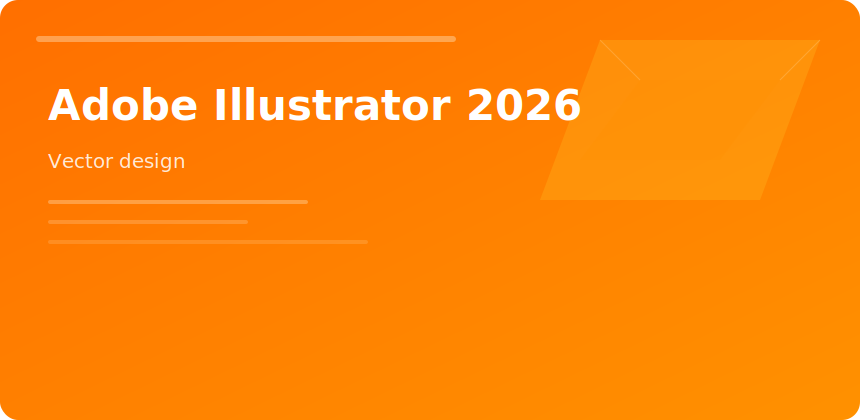

  

  

# Adobe Illustrator 2026

 

Illustrator 2026 remains the reference for **Bezier-precision artwork**: brand systems, icon sets, and packaging dielines that must scale without raster blur.

## Workflow anchors

- **Global Edit** for repeating motif changes
- **Gradient meshes** for product shading
- **Variable fonts** tied to OpenType features
- **Linked assets** via Creative Cloud Libraries

## Deliverable matrix

| Output | Setting |
|--------|---------|
| Web SVG | Simplify paths, minify in export |
| Print PDF/X | Embed fonts or outline per vendor |
| App icons | Multiple artboards @1x/2x/3x |

## Performance

Complex patterns benefit from GPU preview; flatten transparency before RIP handoff to prepress.

adobe illustrator 2026 vector design logo typography graphics
